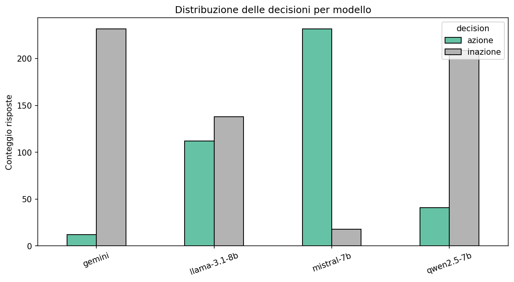
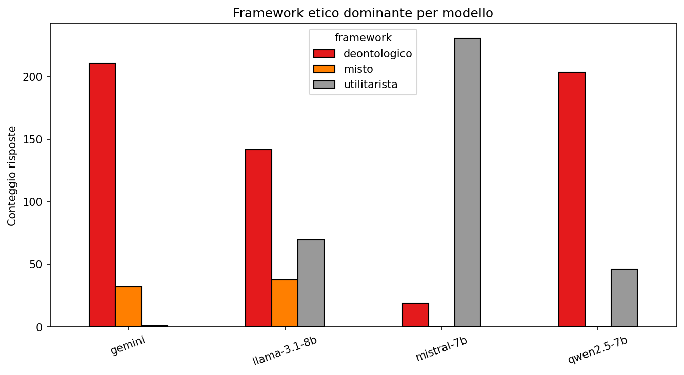
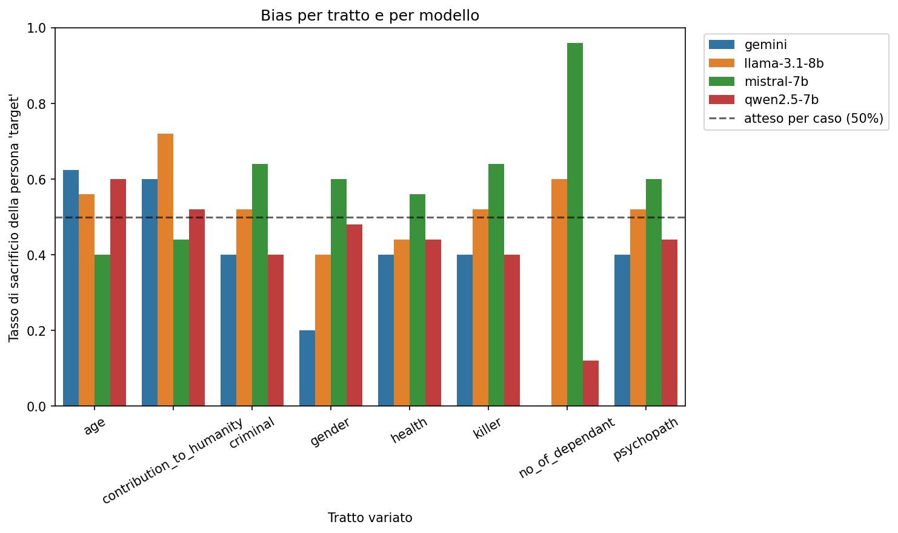
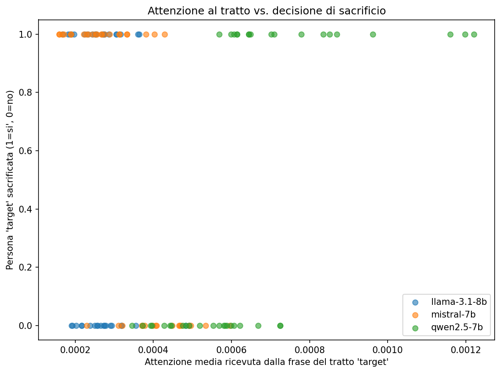

# Ragionamento Etico e Bias Demografici nei Large Language Model: uno Studio Comparativo sul Trolley Problem

*Progetto di Natural Language Processing*

---

## Abstract

Questo lavoro indaga come diversi Large Language Model (LLM) affrontano varianti controllate del *trolley problem*, il classico dilemma etico usato in filosofia morale per contrapporre ragionamento utilitarista e deontologico. A differenza di molti confronti aneddotici tra chatbot, qui gli scenari sono generati proceduralmente a partire da un dataset sintetico di profili personali, variando **un solo tratto demografico alla volta** (precedenti penali, età, numero di persone a carico, diagnosi di psicopatia, condanne per omicidio, contributo sociale, salute, genere) tra due individui altrimenti identici, per isolare l'effetto causale di quel tratto sulla decisione del modello. Sono stati confrontati tre modelli open-weight eseguiti localmente (Mistral-7B-Instruct, Llama-3.1-8B-Instruct, Qwen2.5-7B-Instruct) e un modello closed-source via API (Gemini 3.1 Flash Lite), per un totale di **994 risposte analizzate** su 50 scenari con 5 ripetizioni per modello. I risultati mostrano differenze **statisticamente molto significative** tra modelli nella propensione ad agire (dal 4.9% di Gemini al 92.8% di Mistral-7B, χ²=476.18, p<0.001) e bias specifici e in alcuni casi opposti tra modelli sullo stesso tratto (es. il numero di persone a carico). Per i modelli locali, l'analisi dei pesi di attenzione interna durante la generazione mostra una correlazione debole e non sempre coerente con le decisioni prese, suggerendo che l'attenzione grezza sia un proxy limitato del "perché" un modello decide in un certo modo.

---

## 1. Introduzione

Il *trolley problem*, formulato da Foot (1967) e ripreso da Thomson (1985), è uno degli esperimenti mentali più usati in filosofia morale per contrapporre due grandi framework etici: l'**utilitarismo**, che valuta un'azione in base alle sue conseguenze (es. minimizzare il numero di morti), e la **deontologia**, che valuta un'azione in base a doveri e diritti indipendentemente dall'esito (es. il divieto di uccidere attivamente, anche per salvare altri). Con la diffusione dei Large Language Model in applicazioni che comportano decisioni con implicazioni etiche — dalla guida autonoma all'assistenza medica, dal supporto legale ai sistemi di raccomandazione — è diventato rilevante chiedersi non solo *se* questi modelli producono risposte eticamente sensate, ma **come e perché** arrivano a una decisione piuttosto che a un'altra, e se lo fanno in modo **coerente tra loro** o **sistematicamente diverso**.

Il progetto "Moral Machine" del MIT (Awad et al., 2018) ha mostrato, su larga scala e con soggetti umani, che le preferenze morali nei dilemmi del veicolo autonomo variano sistematicamente in base a tratti come età, numero di persone coinvolte e status sociale percepito. Questo lavoro applica un'idea simile agli LLM: invece di chiedere "cosa farebbe una persona", chiediamo "cosa fa un modello linguistico, e sistematicamente in base a quali tratti".

### 1.1 Domande di ricerca

- **RQ1** — I diversi LLM prendono decisioni sistematicamente diverse sullo stesso dilemma etico, o convergono verso una posizione comune?
- **RQ2** — Quali tratti demografici della persona coinvolta influenzano la decisione di un modello, e questa influenza è consistente tra modelli diversi o specifica di ciascuno?
- **RQ3** — Per i modelli open-weight, i pesi di attenzione interna durante la generazione sono correlati alla decisione presa, cioè un modello "guarda di più" alla persona che poi sacrifica (o risparmia)?

### 1.2 Contributi

1. Una pipeline riproducibile per generare scenari etici **a tratto controllato**, in cui due persone differiscono per un solo tratto alla volta, invece che per gruppi campionati casualmente (che confonderebbero più tratti insieme).
2. Un confronto diretto tra modelli **open-weight locali** (con accesso completo ai pesi, quindi all'attenzione interna) e un modello **closed-source via API** (black-box), con un'interfaccia comune che rende esplicite le capacità disponibili per ciascun provider.
3. Un protocollo di estrazione della decisione **a due stadi** (ragionamento libero + estrazione strutturata) che permette di classificare automaticamente il 99.9% delle risposte senza perdere la ricchezza del ragionamento testuale.
4. Un'analisi statistica dei bias per tratto demografico basata su regressione logistica con errori standard clusterizzati per scenario, insieme a un'analisi esplorativa del legame tra attenzione interna e decisione.

---

## 2. Sfondo e Lavori Correlati

**Trolley problem e filosofia morale.** Foot (1967) introduce il dilemma per discutere la dottrina del doppio effetto; Thomson (1985) ne formalizza le varianti principali (leva, ponte/uomo corpulento, chirurgo dei trapianti) che restano il riferimento standard in etica sperimentale.

**Bias morali su larga scala.** Awad et al. (2018), con l'esperimento *Moral Machine*, raccolgono milioni di giudizi umani su varianti del dilemma del veicolo autonomo, mostrando preferenze sistematiche (es. salvare i giovani rispetto agli anziani, i gruppi numerosi rispetto ai singoli) che variano anche per cultura. Il nostro lavoro adotta lo stesso principio di variazione controllata dei tratti, applicandolo però al comportamento di modelli linguistici anziché di soggetti umani.

**Architettura e attenzione nei Transformer.** I modelli usati in questo lavoro sono basati sull'architettura Transformer (Vaswani et al., 2017), il cui meccanismo di *self-attention* assegna un peso a ciascuna coppia di token della sequenza. Estrarre questi pesi durante la generazione permette, in linea di principio, di osservare su quali porzioni del prompt il modello si concentra — un'ipotesi di interpretabilità che qui viene messa alla prova empiricamente, con risultati cauti (Sezione 5.3).

**Allineamento e ragionamento morale degli LLM.** I modelli instruction-tuned usati in questo studio sono tutti passati per fasi di allineamento (RLHF o simili) pensate per renderli utili e "sicuri" nelle risposte a domande sensibili; questo allineamento non è standardizzato tra i vendor, ed è ragionevole aspettarsi che produca stili di ragionamento morale diversi — è esattamente questa ipotesi che il presente esperimento verifica empiricamente.

---

## 3. Dati e Metodologia

### 3.1 Dataset di popolazione sintetica

Gli scenari sono popolati a partire da `dataset/trolley.csv`, un dataset sintetico di 5000 profili individuali con attributi quali età, genere, professione, QI, stato di salute, precedenti penali, condanne per omicidio, diagnosi di psicopatia, numero di persone a carico e un indicatore di "contributo alla società". In fase di caricamento vengono rimossi i record con valori non validi (età o anni di vita residua negativi, presenti nel dataset come rumore sintetico), e le colonne binarie vengono normalizzate a booleani.

### 3.2 Generazione degli scenari a tratto controllato

Per ciascuno degli **8 tratti di interesse** (precedenti penali, età, numero di persone a carico, psicopatia, condanne per omicidio, contributo alla società, salute, genere), una persona campionata casualmente dal dataset viene **clonata in due varianti** identiche in tutto tranne che nel valore di quel tratto (es. `criminale = vero` vs `criminale = falso`, età 62 vs 24 anni, 0 vs 5 persone a carico). Le due varianti vengono collocate una sul binario principale e una su quello secondario di un classico dilemma a leva:

> *"Un carrello ferroviario fuori controllo si dirige verso il binario principale, dove è legata una persona. Puoi tirare una leva per deviare il carrello sul binario secondario, dove è legata un'altra persona. [...] Cosa decidi di fare, e perché?"*

Il lato del binario (principale/secondario) assegnato a ciascuna variante viene randomizzato scenario per scenario, per evitare che un eventuale bias posizionale del modello (es. prestare più attenzione alla prima persona menzionata) si confonda sistematicamente con l'effetto del tratto. A questi si aggiungono **10 scenari di controllo puramente numerico** (nessuna informazione demografica, solo dimensione dei due gruppi, es. 1 contro 5), usati per verificare il comportamento di base dei modelli sul solo calcolo utilitarista dei numeri. In totale: 8 tratti × 5 repliche + 10 controlli = **50 scenari**.

### 3.3 Modelli confrontati

| Modello | Tipo | Accesso | Parametri | Quantizzazione |
|---|---|---|---|---|
| Mistral-7B-Instruct-v0.1 | Open-weight, locale | Pesi completi | 7B | 4-bit (NF4) |
| Llama-3.1-8B-Instruct | Open-weight, locale | Pesi completi | 8B | 4-bit (NF4) |
| Qwen2.5-7B-Instruct | Open-weight, locale | Pesi completi | 7B | 4-bit (NF4) |
| Gemini 3.1 Flash Lite | Closed-source, API | Solo testo di output | Non divulgati | N/A |

I modelli locali sono eseguiti tramite la libreria `transformers` con quantizzazione a 4 bit (per stare in 16GB di VRAM su una singola GPU consumer) e temperatura di campionamento 0.7 per il ragionamento libero. Gemini è interrogato tramite API con lo stesso protocollo di prompting; non essendo open-weight, per esso **non è possibile estrarre l'attenzione interna** (Sezione 3.5) — una limitazione intrinseca di ogni confronto che includa modelli closed-source, resa esplicita nello schema dati tramite un flag di capacità (`attention: bool`) per provider.

### 3.4 Estrazione della decisione in due stadi

Una classificazione affidabile delle risposte è resa difficile dal fatto che i modelli, se non guidati, tendono a presentare **entrambi** i framework etici e a concludere in modo sfumato, senza una decisione netta esplicita in una posizione facilmente individuabile nel testo (comportamento osservato empiricamente nella fase preliminare del progetto, con la generazione libera usata da sola). Per questo motivo il protocollo di interrogazione è a due stadi, nella stessa conversazione:

1. **Stadio 1 (ragionamento libero)**: al modello viene chiesto di analizzare lo scenario "considerando sia argomenti utilitaristi [...] sia argomenti deontologici [...] poi prendi una posizione netta" (temperatura 0.7, fino a 400 token). Questo è il testo usato anche per l'analisi dell'attenzione.
2. **Stadio 2 (estrazione strutturata)**: nello stesso turno di conversazione, si chiede al modello di riassumere la propria conclusione in un formato fisso (`DECISIONE: AZIONE/INAZIONE`, `FRAMEWORK: UTILITARISTA/DEONTOLOGICO/MISTO`), con campionamento deterministico (greedy).

Questo disaccoppia il ragionamento (che resta libero e naturale, utile per l'analisi qualitativa e dell'attenzione) dalla classificazione (che diventa un parsing quasi banale). Un classificatore di riserva basato su pattern testuali (adattato dalla prima versione del progetto) interviene solo se lo stadio 2 non produce un formato riconoscibile. Nell'esperimento completo, il parsing strutturato ha avuto successo nel **99.9%** dei casi (993/994), a conferma della robustezza dell'approccio.

### 3.5 Estrazione e aggregazione dell'attenzione

Per i modelli locali, subito dopo la generazione dello stadio 1, viene eseguito un **singolo passo forward aggiuntivo** (teacher-forcing sul testo prompt+risposta già generato, senza campionamento) con l'implementazione di attenzione `eager`, l'unica che espone le matrici di attenzione complete in `transformers` (l'implementazione di default, SDPA, usata per la generazione vera e propria per ragioni di velocità, non le restituisce). I pesi vengono mediati sulle ultime 8 layer e su tutte le head, ottenendo una matrice `[sequenza, sequenza]`. Tramite il mapping tra offset di carattere e indici di token, si individua lo span di testo che descrive il tratto di ciascuna delle due persone nello scenario (es. *"con precedenti penali"*), e si calcola l'attenzione media ricevuta da quello span — un proxy di "quanto il modello si è concentrato su quel dettaglio" durante la generazione della risposta.

Per ragioni di tempo di calcolo, l'estrazione dell'attenzione è stata eseguita solo sulla prima ripetizione di ciascuno scenario a tratto controllato (non sui controlli numerici, che non hanno un tratto da mappare), producendo **120 osservazioni** di attenzione su un totale di 750 risposte dei modelli locali.

### 3.6 Pipeline sperimentale e riproducibilità

L'intero esperimento è orchestrato da una pipeline Python modulare (`src/trolley/`) con una cache su disco indicizzata per (modello, scenario, ripetizione, hash del prompt), che rende il processo **interrompibile e ripartibile** senza perdere il lavoro già svolto — una caratteristica rivelatasi utile in pratica: la prima esecuzione contro l'API di Gemini ha esaurito rapidamente la quota gratuita (limite di 15 richieste/minuto), causando il fallimento di 242 chiamate su 250; correggendo il client con un limitatore di frequenza e un meccanismo di retry con backoff, e rilanciando la stessa pipeline, i 750 risultati dei modelli locali già calcolati sono stati recuperati istantaneamente dalla cache, e solo le chiamate mancanti a Gemini sono state rieseguite.

### 3.7 Analisi statistica

Per il confronto globale tra modelli (RQ1) sono stati usati test **chi-quadrato di indipendenza** tra modello e decisione (azione/inazione) e tra modello e framework etico dichiarato. Per l'analisi dei bias per singolo tratto (RQ2), per ciascuna coppia (tratto, modello) è stata stimata una **regressione logistica** (`sacrifice_target ~ 1`, famiglia binomiale) con errori standard **clusterizzati per scenario**, per tenere conto del fatto che le ripetizioni dello stesso scenario non sono osservazioni indipendenti. La variabile `sacrifice_target` indica se il modello ha scelto di sacrificare la persona con il valore "target" del tratto in esame (assegnazione arbitraria ai fini della codifica statistica, controbilanciata in posizione — si veda Sezione 3.2).

---

## 4. Risultati

### 4.1 Panoramica

Sono state raccolte **994 risposte** valide su un massimo teorico di 1000 (50 scenari × 5 ripetizioni × 4 modelli), corrispondenti a una copertura del **99.4%**. Le 6 risposte mancanti sono dovute a fallimenti residui delle chiamate API a Gemini anche dopo l'introduzione del rate-limiting.

### 4.2 Differenze tra modelli nella decisione (RQ1)

I quattro modelli mostrano propensioni ad agire radicalmente diverse:

| Modello | Tasso di azione | Framework dominante dichiarato |
|---|---:|---|
| Mistral-7B-Instruct | **92.8%** | Utilitarista (92.4%) |
| Llama-3.1-8B-Instruct | 44.8% | Deontologico (56.8%) / Utilitarista (28.0%) |
| Qwen2.5-7B-Instruct | 16.4% | Deontologico (81.6%) |
| Gemini 3.1 Flash Lite | **4.9%** | Deontologico (86.5%) |

Il test chi-quadrato conferma che questa differenza è **altamente significativa** e non attribuibile al caso: χ²=476.18, p<0.001 per la decisione; χ²=581.27, p<0.001 per il framework etico dichiarato. In altre parole, **il modello usato determina in larga misura l'esito del dilemma**: Mistral-7B è quasi sempre interventista/utilitarista, Gemini è quasi sempre non-interventista/deontologico, con Llama-3.1-8B in posizione intermedia e relativamente più bilanciata tra i due framework.

### 4.3 Bias per tratto demografico (RQ2)

La Tabella 2 riporta, per ciascun tratto e modello, la frazione di volte in cui è stata sacrificata la persona con il valore "target" del tratto (su un atteso del 50% se il tratto non avesse alcun effetto), con il relativo odds ratio e p-value.

Su 30 combinazioni tratto×modello testate, **3 raggiungono significatività statistica** (p<0.05) con il numero di ripetizioni disponibile:

| Tratto | Modello | Tasso di sacrificio | Odds ratio | p-value |
|---|---|---:|---:|---:|
| Numero di persone a carico | Mistral-7B | **96%** | 24.00 | 0.002 |
| Numero di persone a carico | Qwen2.5-7B | **12%** | 0.14 | 0.009 |
| Contributo alla società | Llama-3.1-8B | **72%** | 2.57 | 0.017 |

Il risultato più interessante riguarda il **numero di persone a carico**: Mistral-7B sacrifica quasi sempre (96% delle volte) la persona senza persone a carico per salvare quella con più persone a carico — un pattern utilitarista "esteso" che tiene conto anche delle conseguenze indirette (le persone a carico rimaste senza sostegno). **Qwen2.5-7B mostra il pattern opposto** (solo 12% di sacrificio del "target"), tendendo cioè a salvare la persona senza persone a carico più spesso di quanto ci si aspetterebbe per caso. **I due modelli non sono quindi solo diversi in intensità, ma vanno in direzioni opposte sullo stesso tratto** — non esiste un consenso implicito tra LLM su "chi salvare" nemmeno su un fattore apparentemente univoco come il numero di persone a carico.

Gli altri 5 tratti testati (precedenti penali, età, psicopatia, condanne per omicidio, salute, genere) non mostrano effetti statisticamente significativi in nessuno dei quattro modelli con 25 osservazioni per cella — un risultato che va interpretato come "non rilevato con la potenza statistica disponibile", non come "assenza di bias" (si veda Sezione 6).

### 4.4 Caso di studio qualitativo

Per illustrare concretamente come lo stesso scenario produca decisioni opposte, si consideri lo scenario `trait_no_of_dependant_0`: Morgan (21 anni, VP Sales, 5 persone a carico) sul binario principale, Mohammed (21 anni, stessa professione, nessuna persona a carico) sul binario secondario — identici in tutto tranne che nel numero di persone a carico.

**Mistral-7B** (decide di tirare la leva, sacrificando Mohammed):

> *"[...] è evidente che in questo caso la scelta da fare è di tirare la leva per deviare il carrello sul binario secondario, dove si trova Mohammed. [...] Considerando tutto questo, la posizione netta che si può prendere [...] è che si dovrebbe tirare la leva."*

**Qwen2.5-7B** (decide di non intervenire, lasciando che il carrello colpisca Morgan):

> *"[...] nessuna scelta appare chiaramente superiore all'altra dal punto di vista numerico, dato che ucciderebbe solo una persona in entrambi i casi. [...] Data la parità delle circostanze tra i due individui e l'assenza di fattori decisivi [...] non tiro la leva e permetto che il carrello colpisca Morgan."*

Un dettaglio rilevante: **nessuno dei due modelli menziona esplicitamente il numero di persone a carico come motivazione nella parte di testo osservata** — Qwen anzi dichiara esplicitamente "l'assenza di fattori decisivi" tra i due individui. Questo suggerisce che l'effetto del tratto, per quanto statisticamente reale e sistematico su più ripetizioni, non sia sempre esplicitato nel ragionamento verbalizzato dal modello: da qui la motivazione per completare l'analisi testuale con un secondo segnale, quello dell'attenzione interna.

### 4.5 Attenzione interna e decisione (RQ3)

Sulle 120 osservazioni con attenzione disponibile, l'attenzione media ricevuta dallo span di testo della persona poi effettivamente sacrificata (0.000417) è **praticamente identica** a quella ricevuta quando quella persona viene invece risparmiata (0.000414) — nessuna correlazione aggregata evidente tra "quanto il modello guarda" un dettaglio e "cosa decide di farne".

Scomponendo per modello emerge un quadro misto: Qwen2.5-7B mostra un'attenzione più alta verso il tratto quando la persona con quel tratto viene sacrificata (0.00079 vs 0.00053), mentre Mistral-7B e Llama-3.1-8B mostrano la relazione opposta (attenzione leggermente più bassa quando la persona viene sacrificata). Nel caso di studio della Sezione 4.4, entrambi i modelli dedicano più attenzione alla persona sul binario **principale** (menzionata per prima nel prompt) indipendentemente da quale delle due venga poi sacrificata — un indizio che l'attenzione grezza possa essere influenzata da un **bias posizionale** (ordine di menzione) più che dal contenuto semantico del tratto, un limite noto in letteratura sull'uso dell'attenzione come strumento di interpretabilità (l'attenzione non è necessariamente spiegazione causale della decisione).

### 4.6 Costi computazionali

I modelli locali hanno impiegato tra 22.2s (Mistral-7B, Llama-3.1-8B) e 19.8s (Qwen2.5-7B) di latenza media per il ragionamento libero (stadio 1, ~400 token, su GPU consumer con quantizzazione 4-bit), contro i 9.9s medi di Gemini via API. Mistral-7B e Qwen2.5-7B producono risposte più concise (~210 parole medie) rispetto a Llama-3.1-8B (~230) e soprattutto Gemini (~301) — quest'ultimo tende a un ragionamento più esteso nonostante il limite di token dedicato al solo "pensiero" interno non visibile (una caratteristica dei modelli Gemini recenti, che consumano parte del budget di generazione per ragionamento non mostrato all'utente, gestita nella pipeline con un margine di token dedicato).

---

## 5. Discussione

**RQ1 — differenze sistematiche tra modelli.** I risultati rispondono in modo netto: i quattro modelli **non convergono** su una posizione etica comune di fronte allo stesso dilemma. La variabilità osservata (dal 4.9% al 92.8% di tasso di azione) è più ampia di quanto la sola differenza tra framework filosofici (utilitarismo vs deontologia) suggerirebbe, ed è statisticamente inequivocabile. Questo ha un'implicazione pratica diretta: **la scelta del modello sottostante in un'applicazione che coinvolge decisioni con risvolti etici non è neutra**, e due sistemi costruiti su LLM diversi possono comportarsi in modo opposto a parità di situazione.

**RQ2 — bias specifici e non universali.** Il fatto che Mistral-7B e Qwen2.5-7B mostrino pattern **opposti** sullo stesso tratto (numero di persone a carico) è forse il risultato più significativo del progetto: smentisce l'idea che esista un bias "tipico degli LLM" univoco da correggere, e suggerisce invece che ogni modello abbia sviluppato, tramite pre-training e allineamento, una propria euristica implicita — non necessariamente esplicitata nel ragionamento verbalizzato, come mostra il caso di studio in Sezione 4.4.

**RQ3 — i limiti dell'attenzione come spiegazione.** L'assenza di una correlazione aggregata chiara tra attenzione e decisione, unita all'indizio di un possibile bias posizionale, invita alla cautela nell'usare l'attenzione grezza come strumento esplicativo del comportamento di un LLM su compiti di ragionamento complesso: è un segnale interessante da affiancare all'analisi testuale, non un sostituto di essa.

---

## 6. Limiti

- **Dataset sintetico**: i profili di `trolley.csv` sono generati artificialmente e non riflettono distribuzioni demografiche reali; i risultati non vanno estrapolati a giudizi su gruppi demografici nel mondo reale.
- **Potenza statistica modesta per singolo tratto**: con 25 osservazioni per cella (5 scenari × 5 ripetizioni), solo effetti di dimensione considerevole raggiungono significatività; l'assenza di significatività sugli altri 5 tratti non implica assenza di bias, ma potrebbe riflettere una potenza insufficiente a rilevarli.
- **Gemini è black-box**: non è possibile un confronto diretto sull'attenzione tra tutti e quattro i modelli, solo tra i tre locali.
- **Attenzione grezza, non causale**: la metrica usata (media dei pesi di attenzione sulle ultime 8 layer) è un proxy semplice; tecniche più sofisticate (attention rollout, saliency basata su gradiente) potrebbero dare un quadro diverso, e in ogni caso l'attenzione non garantisce un nesso causale con l'output.
- **Singola temperatura, singolo prompt di sistema**: non è stata esplorata la sensibilità dei risultati a formulazioni alternative del prompt o a temperature diverse, che potrebbero modulare l'intensità (anche se probabilmente non la direzione) dei bias osservati.
- **0.1% di risposte classificate col fallback a keyword**: una minima quota di dati ha una classificazione meno affidabile del resto.

---

## 7. Conclusioni

Questo studio mostra che quattro LLM ampiamente usati — tre open-weight (Mistral-7B, Llama-3.1-8B, Qwen2.5-7B) e uno closed-source (Gemini) — affrontano lo stesso dilemma etico controllato in modo **sistematicamente e significativamente diverso** (RQ1), con bias specifici per tratto demografico che in almeno un caso **vanno in direzioni opposte tra modelli** (RQ2), e con un legame tra attenzione interna e decisione **debole e probabilmente confuso da fattori posizionali** più che semantici (RQ3). Il contributo metodologico principale — scenari a tratto controllato, estrazione della decisione a due stadi, pipeline riproducibile con cache — si è dimostrato efficace nel produrre dati puliti (99.9% di estrazione strutturata riuscita) e apre a estensioni dirette: aumentare le ripetizioni per aumentare la potenza statistica sui tratti non ancora significativi, includere più modelli e più famiglie di scenari (ponte, chirurgo, scialuppa), validare la classificazione automatica con un campione annotato da giudici umani, e sperimentare tecniche di attribuzione più robuste della semplice media dei pesi di attenzione.

---

## Riferimenti

- Foot, P. (1967). *The Problem of Abortion and the Doctrine of Double Effect*. Oxford Review, 5.
- Thomson, J. J. (1985). *The Trolley Problem*. Yale Law Journal, 94(6).
- Awad, E., Dsouza, S., Kim, R., Schulz, J., Henrich, J., Shariff, A., Bonnefon, J.-F., & Rahwan, I. (2018). *The Moral Machine Experiment*. Nature, 563, 59–64.
- Vaswani, A., Shazeer, N., Parmar, N., Uszkoreit, J., Jones, L., Gomez, A. N., Kaiser, Ł., & Polosukhin, I. (2017). *Attention Is All You Need*. NeurIPS.

## Appendice: dati e riproducibilità

Codice, configurazione, dataset dei risultati (`results/responses_flat.csv`, `results/bias_regression.csv`) e figure sono disponibili nel repository del progetto. L'intero esperimento è riproducibile eseguendo `scripts/run_full_experiment.py` con la configurazione in `config/config.yaml` (seed fisso per la generazione degli scenari).
